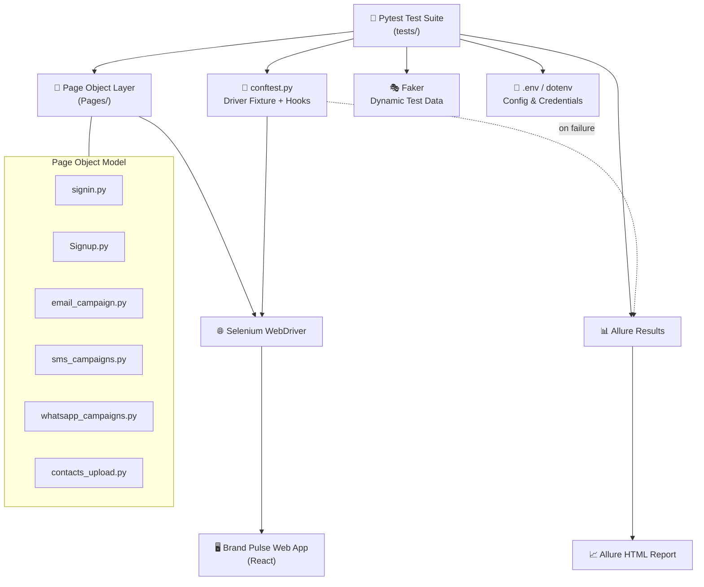
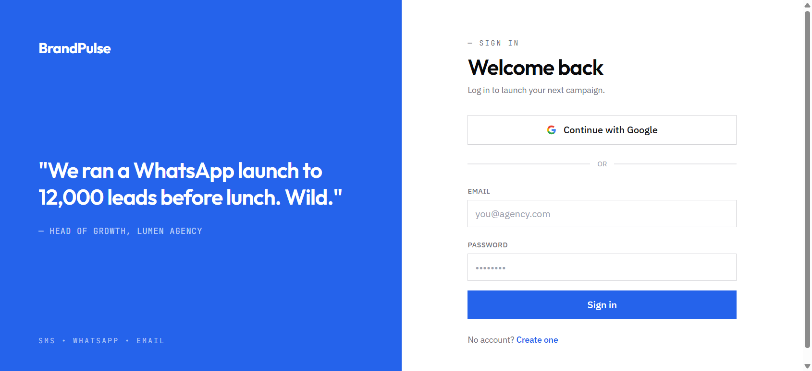

<div align="center">

# 📊 Market Brand Pulse Automation

### Enterprise-Grade Selenium + Pytest Test Automation Framework

*Automating campaign workflows — Email · SMS · WhatsApp · Contact Management*

[](https://www.python.org/)
[](https://www.selenium.dev/)
[](https://pytest.org/)
[](https://allurereport.org/)
[](https://faker.readthedocs.io/)
[](#-license)

[](#)
[](#-page-object-model)
[](#)

<br>

**A production-style QA automation portfolio project** demonstrating clean framework architecture,
reliable UI test design, and professional reporting — built to reflect real-world SDET practices.

<br>

[Overview](#-overview) •
[Features](#-key-features) •
[Architecture](#-architecture) •
[Tech Stack](#-tech-stack) •
[Setup](#-installation--setup) •
[Running Tests](#-running-the-tests) •
[Reporting](#-allure-reporting) •
[Screenshots](#-screenshots) •
[Roadmap](#-future-enhancements)

</div>

<br>

---

## 📖 Overview

**Market Brand Pulse Automation** is a Python-based Selenium automation framework built to validate
end-to-end campaign workflows for the **Brand Pulse** marketing platform. It follows the
**Page Object Model (POM)** design pattern with **Pytest** as the test runner, producing a suite that is
readable, maintainable, and easy to extend as the application grows.

The framework automates real user journeys — signing in, creating **Email**, **SMS**, and **WhatsApp**
campaigns, and importing contacts via CSV — while generating **dynamic, collision-free test data**
with Faker and producing **rich Allure reports** with automatic failure screenshots.

> 💡 This project is designed as a **QA Engineering portfolio piece** — showcasing framework design
> decisions, not just individual test scripts.

<br>

## ✨ Key Features

<table>
<tr>
<td width="33%" valign="top">

### 🔐 Auth Automation
End-to-end sign-in and sign-up flow coverage with resilient, explicit-wait-based locators.

</td>
<td width="33%" valign="top">

### 📣 Multi-Channel Campaigns
Automated creation flows for **Email**, **SMS**, and **WhatsApp** campaigns via a shared,
reusable campaign pattern.

</td>
<td width="33%" valign="top">

### 📇 Contact Import
CSV-driven contact upload validation using dynamic sample data.

</td>
</tr>
<tr>
<td width="33%" valign="top">

### 🧱 Page Object Model
Every screen is encapsulated as a class — tests stay declarative and locators stay maintainable.

</td>
<td width="33%" valign="top">

### 🧪 Ordered Test Execution
`pytest-order` sequences the suite to mirror a real user's journey through the app.

</td>
<td width="33%" valign="top">

### 📊 Allure Reporting
Step-by-step reporting with auto-attached **failure screenshots** for fast debugging.

</td>
</tr>
<tr>
<td width="33%" valign="top">

### 🎭 Dynamic Test Data
**Faker** generates unique campaign names/messages per run — no stale data collisions.

</td>
<td width="33%" valign="top">

### 🛡️ Resilient Clicks
A `_safe_click` fallback (native → JS click) handles flaky React re-renders gracefully.

</td>
<td width="33%" valign="top">

### ⚙️ Config via `.env`
Environment-based credentials/URLs keep secrets out of source control.

</td>
</tr>
</table>

<br>

## 🏗️ Architecture



<br>

## 🧰 Tech Stack

| Category | Technology | Purpose |
|---|---|---|
| **Language** |  | Core scripting language |
| **UI Automation** |  | Browser automation & element interaction |
| **Test Runner** |  | Test discovery, fixtures, assertions |
| **Ordering** | `pytest-order` | Deterministic, journey-based test sequencing |
| **Reporting** |  | Rich HTML reports, steps, attachments |
| **Test Data** |  | Realistic, unique dynamic data |
| **Driver Mgmt** | `webdriver-manager` | Automatic ChromeDriver provisioning |
| **Config** | `python-dotenv` | Environment-based secrets/config |
| **Design Pattern** | Page Object Model (POM) | Maintainable, scalable test architecture |

<br>

## 📁 Project Structure

```
Market_Brand-Pulse_Automation/
│
├── 📂 Pages/                        # Page Object Model classes
│   ├── signin.py                    # Login page interactions
│   ├── Signup.py                    # Registration page interactions
│   ├── email_campaign.py            # Email campaign creation flow
│   ├── sms_campaigns.py             # SMS campaign creation flow
│   ├── whatsapp_campaigns.py        # WhatsApp campaign creation flow
│   └── contacts_upload.py           # Contact CSV import flow
│
├── 📂 tests/                        # Pytest test suite
│   ├── test_signin.py               # 🔐 Authentication tests
│   ├── test_signup.py               # 📝 Registration tests
│   ├── test_email.py                # 📧 Email campaign tests
│   ├── test_sms.py                  # 💬 SMS campaign tests
│   ├── test_whatsapp.py             # 🟢 WhatsApp campaign tests
│   └── test_contacts_upload.py      # 📇 Contact import tests
│
├── 📂 data/                         # Test data assets (CSV, fixtures)
├── 📂 docs/images/                  # Screenshots & documentation media
├── 📂 allure-results/               # Raw Allure result files (generated)
├── 📂 report/                       # Generated Allure HTML report
│
├── ⚙️ conftest.py                    # WebDriver fixture + failure screenshot hook
├── ⚙️ pytest.ini                     # Pytest configuration
├── 📄 requirement.txt                # Python dependencies
├── 📄 sample contacts.csv            # Sample CSV for import tests
├── 🔒 .env                           # Environment credentials (not committed)
└── 📘 README.md                      # You are here
```

<br>

## ⚙️ Installation & Setup

<details>
<summary><b>📦 Click to expand full setup guide</b></summary>

<br>

### Prerequisites
- ✅ Python 3.10+
- ✅ Google Chrome (latest)
- ✅ Git

### 1️⃣ Clone the repository
```bash
git clone https://github.com/srinivaspamu93-debug/Market_Brand-Pulse_Automation.git
cd Market_Brand-Pulse_Automation
```

### 2️⃣ Create & activate a virtual environment
```bash
python -m venv .venv

# Windows
.venv\Scripts\activate

# macOS / Linux
source .venv/bin/activate
```

### 3️⃣ Install dependencies
```bash
pip install -r requirement.txt
```

### 4️⃣ Configure environment variables
Create a `.env` file in the project root:
```env
LOGIN_URL=https://marketing-blast-2.emergent.host
LOGIN_EMAIL=your-test-account@example.com
LOGIN_PASSWORD=your-secure-password
```

> 🔒 `.env` is git-ignored — never commit real credentials.

</details>

<br>

## ▶️ Running the Tests

```bash
# Run the full suite with Allure result collection
.venv\Scripts\python.exe -m pytest tests\ --alluredir=allure-results -v

# Run a specific test file
.venv\Scripts\python.exe -m pytest tests\test_email.py -v

# Run tests matching a keyword
.venv\Scripts\python.exe -m pytest -k "sms" -v
```

### 🔄 Test Execution Workflow

Tests run in a fixed, journey-driven order via `pytest-order`, mirroring how a real user
moves through the app:

```
1️⃣ Sign In  →  2️⃣ Sign Up  →  3️⃣ Email Campaign  →  4️⃣ SMS Campaign  →  5️⃣ WhatsApp Campaign  →  6️⃣ Contact Import
```

Each stage is isolated in its own test class/file, but ordered so failures surface in the
same sequence a manual tester would hit them.

<br>

## 🧱 Page Object Model

This framework strictly follows **POM** to separate *what a test does* from *how the UI is driven*:

- Every screen/flow (`SignIn`, `campaign_email`, `campaign_sms`, `campaign_whatsapp`,
  `ContactImport`) is its own class in `Pages/`.
- Tests call **high-level methods** (`campaign_page.campaign(url, email, password)`) instead of
  touching locators directly — UI changes only require updates in one place.
- All interactions use `WebDriverWait` + `expected_conditions` — **no hard-coded sleeps** —
  making the suite resilient to React's async rendering.
- A shared `_safe_click()` helper falls back to a JavaScript click when a native Selenium click
  is intercepted, reducing flaky failures.

```python
# Example: tests stay clean and readable
campaign_page = campaign_sms(driver)
campaign_page.campaign(url, email, password)
```

<br>

## 📊 Allure Reporting

Every test run produces structured, step-by-step **Allure** reports — including automatic
screenshots on failure via a `pytest_runtest_makereport` hook in `conftest.py`.

```bash
# Generate the HTML report from results
allure generate allure-results --clean -o allure-report

# Open it in your browser
allure open allure-report
```

**What you get:**
- ✅ Pass/fail breakdown by feature & severity
- 🧩 Step-level execution trace (`allure.step`) for every test
- 📸 Auto-attached screenshots on failures
- 🕒 Execution timing & historical trends across runs

<br>

## 🖼️ Screenshots

> ⚠️ **Note:** The files currently in `docs/images/` (`dashboard.png`, `execution.png`,
> `passed_failed.png`, `allure-report.png`) are duplicates of the login screen capture.
> Replace them with real captures of each screen below before publishing — the sections
> are wired up and ready to go.

<div align="center">

<details open>
<summary><b>🔐 Login Page</b></summary>
<br>

</details>

<details>
<summary><b>🏠 Dashboard</b></summary>
<br>

</details>

<details>
<summary><b>💬 SMS Campaign Creation</b></summary>
<br>

</details>

<details>
<summary><b>📇 Contact Import</b></summary>
<br>

</details>

<details>
<summary><b>📈 Allure Report</b></summary>
<br>

</details>

</div>

<br>

## 🎬 Demo (GIFs)

<div align="center">

| Test Execution in Terminal | Allure Report Walkthrough |
|:---:|:---:|
|  |  |
| *placeholder — add a terminal recording GIF* | *placeholder — add an Allure report walkthrough GIF* |

</div>

<br>

## 🔁 CI/CD Readiness

This framework is structured to drop straight into a CI pipeline — headless-friendly
WebDriver setup, isolated `.env`-based config, and Allure output ready for artifact upload.
A sample **GitHub Actions** workflow to add at `.github/workflows/tests.yml`:

```yaml
name: Run Selenium Test Suite

on: [push, pull_request]

jobs:
  test:
    runs-on: ubuntu-latest
    steps:
      - uses: actions/checkout@v4
      - uses: actions/setup-python@v5
        with:
          python-version: "3.12"
      - name: Install dependencies
        run: pip install -r requirement.txt
      - name: Run tests
        env:
          LOGIN_URL: ${{ secrets.LOGIN_URL }}
          LOGIN_EMAIL: ${{ secrets.LOGIN_EMAIL }}
          LOGIN_PASSWORD: ${{ secrets.LOGIN_PASSWORD }}
        run: pytest tests/ --alluredir=allure-results
      - name: Upload Allure results
        uses: actions/upload-artifact@v4
        with:
          name: allure-results
          path: allure-results
```

<br>

## 🚀 Future Enhancements

- [ ] 🐳 Dockerized test execution with Selenium Grid
- [ ] ☁️ Cross-browser/cloud execution (BrowserStack / Sauce Labs)
- [ ] 🔁 GitHub Actions CI pipeline with Allure report publishing to GitHub Pages
- [ ] 🧵 Parallel test execution via `pytest-xdist`
- [ ] 🔌 API-layer test coverage alongside UI flows
- [ ] 📱 Mobile-responsive UI test coverage
- [ ] 🧪 Negative/edge-case scenario coverage per campaign type

<br>

## 👤 Author

<div align="center">

**Srinivas Pamu**

QA / SDET — Selenium · Python · Test Automation Frameworks

[](https://github.com/srinivaspamu93-debug)

</div>

<br>

## 📜 License

This project is licensed under the **MIT License** — feel free to use it as a reference or
starting point for your own automation framework.

<br>

---

<div align="center">

### ⭐ If this project helped you, consider giving it a star!

*Built with ❤️ and a lot of `WebDriverWait` — showcasing modern Python test automation practices.*

</div>
